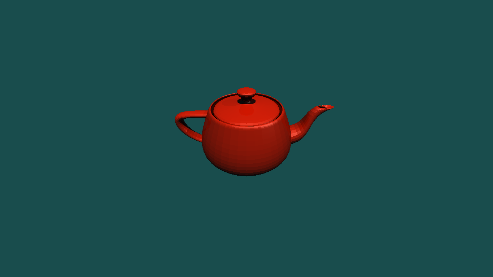

# Ray Tracer

This is a toy ray tracer implemented for educational purposes. It demonstrates the basic principles of ray tracing,
including ray-object intersection, shading, and reflections.

## Features

- Ray-sphere intersection, ray-triangle intersection, and ray-plane intersection
- Basic Phong shading model (ambient, diffuse, specular)
- Reflections
- Shadows
- Mesh support
- A simple DSL for scene description

## Usage

Build the project:

```
go build -o main main.go
```

Run the ray tracer with default flags:

```
./main
```

### Flags

- `--width <int>`: Width of the output image in pixels (default: `1366`).
- `--height <int>`: Height of the output image in pixels (default: `768`).
- `--fov <int>`: Field of view in degrees (default: `90`).
- `--input <path>`: Path to the triangle mesh file (default: `teapot.obj`).
- `--output <path>`: Path to save the output image (default: `image`).
- `--type <string>`: Type of the output image: `ppm` or `gif` (default: `ppm`).
- `--scene <string>`: Path to the scene file (default: `./scenes/empty.scene`).

### Scene File Format

A scene file consists of the following elements:

- `background`: Color in `hex`
- `ambient`: Vec3
- `light`: Color, diffuse, and specular coefficients
- `camera`: Vec3
- `sphere`: Center, radius, and material
- `triangle`: V0, V1, V2, and material
- `plane`: Width, point, normal, and material

Example scene file (`basic.scene`):

```plaintext
background #194D4D

ambient 0.1,0.1,0.1

camera 0,5,-5

light {
    pos 0,30,-10
    diffuse 0.8,0.8,0.8
    specular 0.8,0.8,0.8
}

sphere {
    radius 10
    center 70,-40,10
    material red
}
```

## Example Output



## License

This project is licensed under the MIT License - see the [LICENSE](./LICENSE) file for details.
